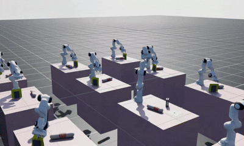

# Sheet RL — pulling a deformable sheet out of a slot

<p align="center">
  
</p>

A Franka Panda learns to pinch the free edge of a cloth sheet standing upright in a narrow slot and
draw it straight up and clear. Built on [Isaac Lab](https://github.com/isaac-sim/IsaacLab) as a
standalone extension — the scene, robot and manager framework are inherited; the task is not.

**Task id:** `Template-Sheet-Rl-v0`  ·  **RL library:** rsl-rl (PPO)  ·  **Physics:** Newton / MJWarp with a VBD cloth solver

## The task

Two thin walls 1 cm apart hold a 20 × 20 cm sheet upright, with about 5 cm projecting above them.
That projecting strip is the point of the slot: a free edge, held vertical and presented side-on, is
far easier to pinch than a sheet lying flat with nothing to get a finger under. Slot and sheet are
placed together at reset with a shared offset and yaw drawn over ±90°, and a mannequin arm is
mirrored to the opposite side of the table.

Success is the sheet's *lowest* node clearing the wall tops by 2 cm while the gripper is holding it —
measured on the lowest node so the whole sheet is out, not merely tilted out.

## Reward

Two dense terms shape the approach, two one-shot terms pay for the outcome, and the rest are charges.

| term | what it pays for |
|---|---|
| `approach` | fingertips to the middle of the sheet's top edge, on two `tanh` scales so the pull is felt from across the table and again at the grasp |
| `alignment` | hand pointing down and the closing axis square across the slot |
| `square_progress` | the *change* in squareness — potential-based, so it pays for turning the wrist rather than for having turned it, and cannot be farmed |
| `grasp_stage` | one-shot bonuses for the first grasp on the top edge and for extraction; charges for closing on nothing and for letting go early |
| `lift_progress` | potential-based climb from the grasp up to the extraction bonus, gated on actually holding |
| `table_clearance` | a slope pushing back against drifting into the table |
| `gripper_recommit` | every gripper closure after the first, counted on the commanded bit rather than the measured width |
| `ee_speed` | hand speed above 0.2 m/s, exponential to 9.52 at 1 m/s then flat (off unless `--slow`) |

A grasp is judged by whether cloth is actually between the pads — fingers shut with a sheet node
inside `capture_radius` — not by the pose the gripper struck. Pose gates were tried and rejected a
hand-flown grasp that plainly worked; `alignment` still encourages the posture, it just cannot veto
a grasp that succeeded.

## Setup

```bash
python -m pip install -e source/sheet_rl
python scripts/list_envs.py          # confirms the task registered
```

Requires a Python interpreter with Isaac Lab installed. See the
[Isaac Lab installation guide](https://isaac-sim.github.io/IsaacLab/main/source/setup/installation/index.html).

## Running

**Train**

```bash
python scripts/train.py --rl_library rsl_rl --task Template-Sheet-Rl-v0 --num_envs 1024 \
  agent.run_name=grasp_v1 agent.experiment_name=sheet_grasp \
  agent.max_iterations=3000 agent.num_steps_per_env=24 \
  agent.actor.hidden_dims=[256,128,64] agent.critic.hidden_dims=[256,128,64] \
  agent.actor.obs_normalization=true agent.critic.obs_normalization=true \
  agent.clip_actions=2.4 agent.algorithm.learning_rate=3.0e-4 agent.save_interval=20
```

Add `--slow` to arm the hand-speed charge, which trades a slower arm for a lower return.

To resume, add `--resume --load_run <run-dir> --checkpoint model_<n>.pt` and repeat every
`agent.*` override — the checkpoint stores weights and optimizer state, not configuration.
`max_iterations` is *additive* from the loaded iteration, not a target.

**Watch**

```bash
python scripts/play.py --rl_library rsl_rl --task Template-Sheet-Rl-v0 --viz newton_gl \
  --checkpoint logs/rsl_rl/sheet_grasp/<run>/model_<n>.pt \
  agent.actor.hidden_dims=[256,128,64] agent.critic.hidden_dims=[256,128,64] \
  agent.actor.obs_normalization=true agent.critic.obs_normalization=true agent.clip_actions=2.4 \
  --lite
```

`--lite` is one environment at wall-clock speed — a watching tool rather than a sampling one, and
cheap enough to sit alongside a training run.

**Measure how fast the arm actually moves**

```bash
python scripts/eval_joint_speed.py --task Template-Sheet-Rl-v0 --num_envs 16 --headless \
  --checkpoint logs/rsl_rl/sheet_grasp/<run>/model_<n>.pt --steps 600 \
  agent.actor.hidden_dims=[256,128,64] agent.critic.hidden_dims=[256,128,64] \
  agent.actor.obs_normalization=true agent.critic.obs_normalization=true agent.clip_actions=2.4
```

Prints per-joint and end-effector speed percentiles and writes `joint_speed.png` beside the
checkpoint. Capping `arm_action.scale` sets how fast the arm *may* move; this says how fast it
chooses to.

**Fly it by hand**

```bash
python scripts/teleop_keyboard.py --free_run
```

Same scene the policy trains on, with the reward printed live per term.

## Reading the logs

`Episode_Reward/*` is the episodic sum divided by `max_episode_length_s` (**16.65 s**), so multiply
by 16.65 to get the real per-episode value. `Events/*` are per-episode means of the grasp
diagnostics, published on reset.

After resuming, ignore `Mean reward` for the first ~25 iterations: `init_at_random_ep_len`
randomises episode phase, so the statistics buffer fills with truncated stubs and reads far below
the policy's actual performance. Wait for `Mean episode length` to recover before judging anything.

## Layout

```
scripts/                     train, play, teleop, joint-speed evaluation
source/sheet_rl/.../sheet_rl/
├── sheet_rl_env_cfg.py      scene, actions, rewards, terminations, events, commands
├── agents/                  PPO hyperparameters
└── mdp/                     rewards, terminations, observations, events, commands
```

## Pinned against

This task subclasses Isaac Lab internals (`FrankaClothEnvCfg`, `isaaclab_tasks.core.lift.mdp`,
Newton's articulation data), so upstream changes can break it. Developed against:

| | version |
|---|---|
| Isaac Lab | `68d7f932d` (`perf-2026-07-06-389-g68d7f932d`) |
| rsl-rl-lib | `5.4.1` |
